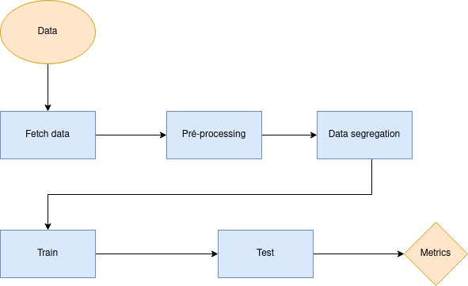
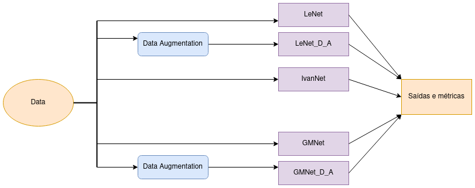
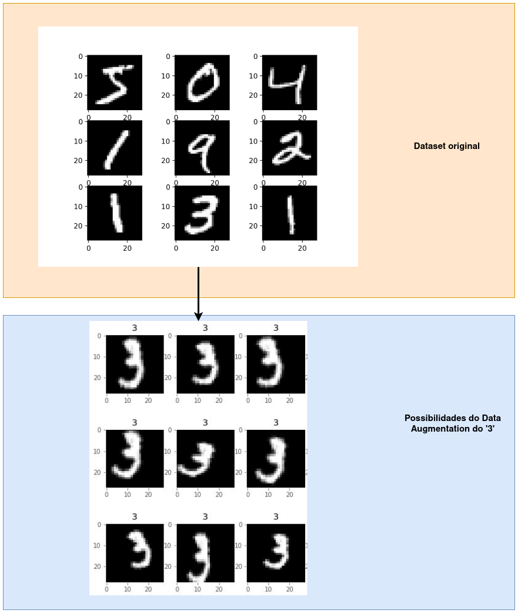
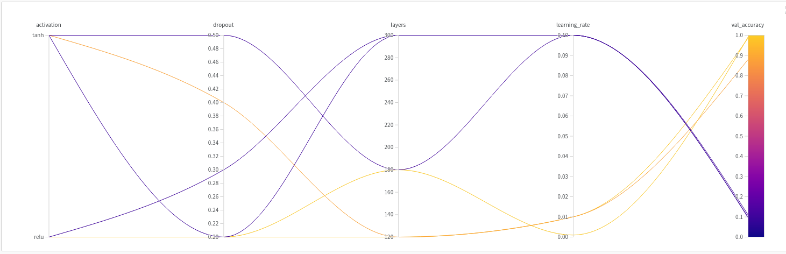
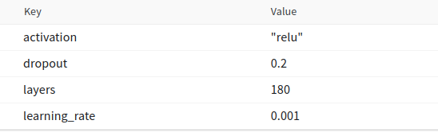
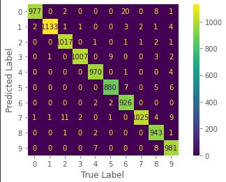
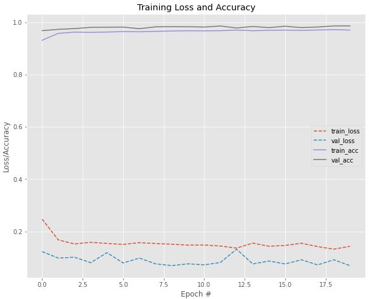

# MODEL-CARD_GMNet

Model card é uma explicação sucinta sobre o modelo na forma de um documento, levando a compreender os passos, resultados e ideias geradas durante a etapa de criação. Mais informações sobre este tipo de documento encontra-se em https://arxiv.org/pdf/1810.03993.pdf .
 
## Model Details
O modelo foi criado por Gildson Bezerra e Micael Balza durante a disciplina de Inteligência Artificial Embarcada ministrada na UFRN em 2022.2 pelo professor Dr. Ivanovitch Medeiros Dantas da Silva. O pipeline dos dados foi feito utilizando ferramentas como Google colab, Scikit-Learn e Weights & Bias e Python como linguagem de programação para reproduzir e melhorar a estrutura de rede neural convolucional proposta em 1998 por LeCun chamada de LeNet-5. A ideia é reproduzir a sua versão original, uma modificada pelo professor chamada de IvanNet e implementar esta versão modificada chamada GMNet com o intuito de melhorar a acurácia comparado aos outros modelos. A big-picture do fluxo de dados e etapas é descrita na imagem a seguir:
 

 
## Intended Use
Este GitHub é composto pelas arquivos:  a) ``LeNet.ipynb``, b) ``GMnet.ipynb``, que são os nomes dos arquivos que contém os modelos para o LeNet e ivanNet em (a) e o GMNet em (b). Cada arquivo já contém as etapas de coleta do dataset; pré-processamento; separação dos dados; treinamento; validação e teste; como também outras etapas referentes a Weights & Bias e a importação de bibliotecas.
 
## Training Data
 
O objetivo é reproduzir a rede LeNet-5 e sua variação IvanNet e compará-las em termos de acurácia com uma nova implementação GMNet. De modo que o dataset é o mesmo para todas as implementações, foi realizado a etapa de Data Augmentation em alguns treinamentos conforme figura abaixo, para comparar os efeitos que se tem na generalização e acurácia.

 

O dataset deste problema é conhecido por MNIST standard dataset, composto por 70.000 imagens de algarismos de 0 a 9 com uma resolução de 28 x 28 pixels em tons de cinza(1 canal). A etapa de Data Augmentation modifica levemente algumas imagens do dataset original com relação a rotação, zoon e localização dentro de uma faixa de valores definido, aumentando assim a generalização dos dados e consequentemente a do modelo.

 (Imagem retirada e modificada de <https://raw.githubusercontent.com/ivanovitchm/embedded.ai/main/lessons/week_08/Week%2008%20-%20Part%20I.pdf>. Acesso em 06/11/2022 as 18:00)
 
 
## Evaluation Data
No arquivo (a) os dados são divididos em treinamento e teste, de modo que 60.000 imagens ficam para treinamento e 10.000 imagens para teste, já quando implementamos o GMNet o dataset foi subdividido em treinamento, teste e validação na quantidade de 45.000, 10.000 e 15.000 respectivamente. Esta mudança foi necessária para se ter um feedback do treinamento já que utilizamos o sweeps para encontrar uma configuração de rede melhor.
 
## Metrics
Foram usadas métricas de performance comuns em técnicas de ML, algumas delas são vistas a seguir e foram usadas como comparativo entre ambas soluções:
 
[accuracy](https://scikit-learn.org/stable/modules/generated/sklearn.metrics.accuracy_score.html), [f1](https://scikit-learn.org/stable/modules/generated/sklearn.metrics.f1_score.html#sklearn.metrics.f1_score), [precision](https://scikit-learn.org/stable/modules/generated/sklearn.metrics.precision_score.html#sklearn.metrics.precision_score), [recall](https://scikit-learn.org/stable/modules/generated/sklearn.metrics.recall_score.html#sklearn.metrics.recall_score).
 
Reprodução da LeNet-5
 
**Stage [Run]**                        | **Accuracy** | **F1** | **Precision** | **Recall** |
---------------------------------|--------------|--------|---------------|------------|
LeNet-5 [expert-universe-1](https://wandb.ai/micaelbalza/lenet-5?workspace=user-micaelbalza) | 0.9493      | 0.9493 | 0.9498        | 0.9493     |
LeNet_D_A [upbeat-fire-1](https://wandb.ai/micaelbalza/lenet-5-data_augumentation?workspace=user-micaelbalza)  | 0.9357      | 0.9357 | 0.9357        | 0.9357     |
 
Reprodução da IvanNet-5
 
**Stage [Run]**                        | **Accuracy** | **F1** | **Precision** | **Recall** |
---------------------------------|--------------|--------|---------------|------------|
IvanNet [electric-glitter-1](https://wandb.ai/micaelbalza/IvaNet-5?workspace=user-micaelbalza) | 0.9199      | 0.9199 | 0.9222        | 0.9222     |
 
GMNet
 
**Stage [Run]**                        | **Accuracy** | **Layers** | **Activation** |
---------------------------------|--------------|--------|---------------|------------|
GMNet-sweep-1 [dulcet-sweep-1](https://wandb.ai/gildson/GMNet-sweep/sweeps/uc4n5obh?workspace=user-micaelbalza) | 0.7637      | 120 | tanh        |
GMNet-sweep-2 [fast-sweep-2](https://wandb.ai/gildson/GMNet-sweep/sweeps/uc4n5obh?workspace=user-micaelbalza)  | 0.1011      | 300 | tanh        |
GMNet-sweep-1 [swift-sweep-3](https://wandb.ai/gildson/GMNet-sweep/sweeps/uc4n5obh?workspace=user-micaelbalza) | 0.1      | 180 | tanh       |
GMNet-sweep-2 [vivid-sweep-4](https://wandb.ai/gildson/GMNet-sweep/sweeps/uc4n5obh?workspace=user-micaelbalza)  | 0.9912      | 180 | relu        |
GMNet-sweep-1 [vibrant-sweep-5](https://wandb.ai/gildson/GMNet-sweep/sweeps/uc4n5obh?workspace=user-micaelbalza) | 0.1036      | 300 | relu        |
GMNet-sweep-1 [cerulean-sweep-6](https://wandb.ai/gildson/GMNet-sweep/sweeps/uc4n5obh?workspace=user-micaelbalza) | 0.9699      | 120 | relu        |
 
A plataforma do Wandb gerou as seguintes configurações no sweep:

 
 
 
## Ethical Considerations
 
O dataset é composto por 7000 imagens de algarismos variando de 0 a 9. Desta forma os atributos fornecidos ao modelo são para classificar este tipo de dado, e sem garantia de funcionar corretamente em imagens de variados tamanhos diferentes do utilizado no treinamento.
 
## Caveats and Recommendations

Comparando as implementações com e sem o processo de Data Augmentation foi percebido uma diminuição no valor da acuracia, aumento do tempo gasto em todo o processo com o objetivo de buscar uma maior generalização do modelo, como mostrado nas métricas geradas no LeNet-5 e LeNet-5_D_A.

Conseguimos criar um modelo que superou as implementações propostas no arquivo (B) ultilizando o sweeps onde a GMNet-sweep-2 [vivid-sweep-4](https://wandb.ai/gildson/GMNet-sweep/sweeps/uc4n5obh?workspace=user-micaelbalza) atingiu uma acuracia de 0.9912222027778624 durante a época 15 e uma acuracia de 0.991333305835724 no dataset de validação.
As configurações utilizadas são mostradas na imagem a seguir:

Gerando a seguinte matriz de confusão:

Comparando os dataset de treinamento e validação temos:

Nota-se que como a acurácia do dataset de treinamento e de validação estão proximas no grafico demostrando assim baixo overfit.

